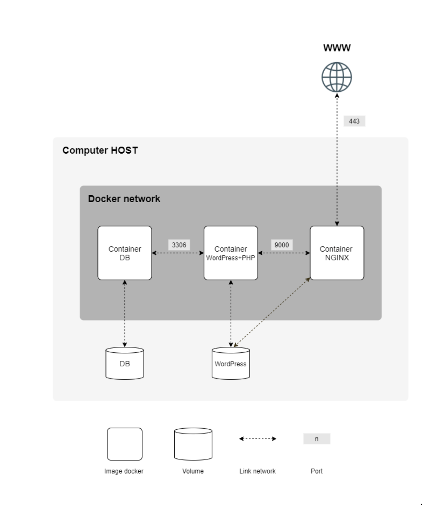

# Cloud1


```
.
├── diagram.png
├── Makefile
├── README.md
├── .env
├── srcs
│   ├── docker-compose.yml
│   └── requirements
│       ├── mariadb
│       │   ├── conf
│       │   │   └── mariadb-server.cnf
│       │   ├── Dockerfile
│       │   ├── entrypoint.sh
│       │   └── tools
│       │       └── init-db.sh
│       ├── nginx
│       │   ├── conf
│       │   │   └── default.conf
│       │   ├── Dockerfile
│       │   └── entrypoint.sh
│       └── wordpress
│           ├── conf
│           │   └── www.conf
│           ├── Dockerfile
│           ├── entrypoint.sh
│           ├── sources
│           │   └── resume.html
│           └── tools
│               └── wp-config.sh
├── terraform
│   ├── instance.tf
│   ├── main.tf
│   └── output.tf
└── ansible
    ├── hosts
    ├── install.yaml
    └── roles
        └── start
            └── tasks
                └── main.yaml

```

  Create a Scaleway account, install and configure your Scaleway CLI.  Create a
  project on your Scaleway account, fetch your project ID and put it in the
  `project_id` field in `terraform/main.tf`.  Add your SSH public key to your
  project.

```
  $ git clone https://github.com/alilin2508/Cloud-1
  $ cd Cloud-1/terraform
  $ terraform apply -auto-approve
  $ terraform output public_ip >../ansible/hosts
  $ cd ../ansible
```

  Bind your instance IP address to a domain name (free ones on duckdns.org) and
  update the .env `DOMAIN_NAME` variable accordinly.

```
  $ ansible-playbook -i hosts install.yaml
```

  Don't forget to `$ terraform  apply -destroy -auto-approve` one done.


# Todo

  - ~~ping instance in ansible playbook~~
  - install and configure phpmyadmin
<<<<<<< Updated upstream
  - server auto-reboot if poweroff
  - deploy on multiple servers
  - update makefile
  - domain name
  - réparer le site
  - vault le .env
  - create registry
=======
  - ~~server auto-reboot if instance reboot~~
  - ~~deploy on multiple servers~~
  - update makefile to terraform and ansible
  - ~~domain name~~
  - ~~réparer le site~~
>>>>>>> Stashed changes
